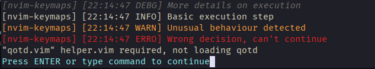

# nvim-clerk

Simple logging package

## Setup

```lua
local log = require('nvim-clerk')

log.setup({
    config = {
        min_level = log.levels.INFO
    },
    create_writer = function(factory)
        return {
            factory.create_nvim_console_writer("nvim-keymaps", true),
            factory.create_nvim_plugin_file_writer("nvim-keymaps"),
        }
    end
})
```
## Usage

```lua
local log = require('nvim-clerk')

log.debug("More details on execution")
log.info("Basic execution step")
log.warn("Unusual behaviour detected")
log.error("Wrong decision, can't continue")
```


